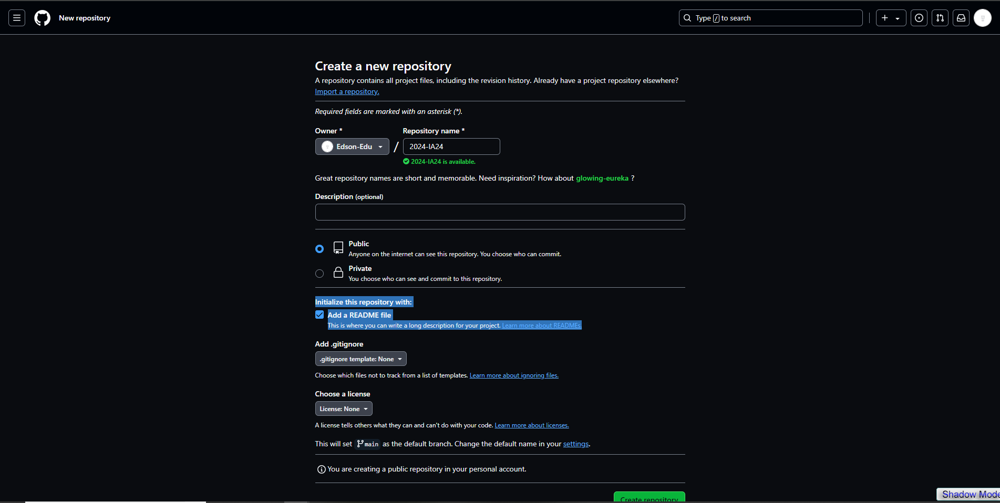
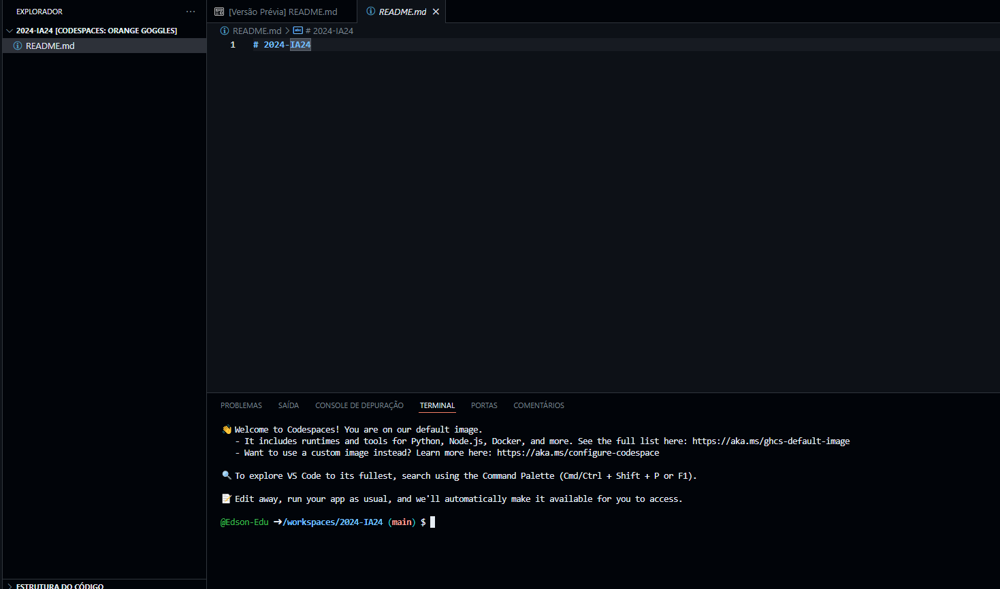

# 2024-IA22-2TRI

Programação II

Vamos programar nosso primeiro servidor com rotas!! :)

!Leia todo o topico antes de iniciar as tarefas!

### Qualquer duvida / erro mande mensagem nesse Whatssap: (47) 98440-0475

# Iniciando um Repositório  no CodeSpace
Crie um Repositório  com o nome "2024-IA24".

Lembrando: O Repositório  deve ser publico e com o arquivo README incluso.

Agora nessa tela, voce ira clicar no botao `code` > `codespace on main` e depois no ``Simbolo + ``


Espere a paginar carregar para continuar os proximos passos. Sua tela devera estar assim:
 

# Iniciando um projeto Node.js com TypeScript


No Terminal digite os seguintes comandos, lembre de executar um por vez e esperar o tempo de carregamento de cada.

```
npm init -y
npm install express cors sqlite3 sqlite
npm install --save-dev typescript nodemon ts-node @types/express @types/cors
npx tsc --init
mkdir src
touch src/app.ts

```

# Configurando o ` tsconfig.json ` 

No arquivo ``tsconig.json`` mude a linha ` "outDir": "./" ` , para 
` "outDir": "./dist" `, e adicione embaixo a linha ` "rootDir": "./src"`, (lembre-se de adicionar uma virgula antes de pular a linha e o ``// antes de rootDir``) seu arquivo de configuração do compilador do TypeScript ficará mais ou menos assim.

Dica: Para encontrar rapidamente: `Control + F` e coloque `outDir`.

Lembrando: Cuidado com as ""  para nao ter nenhum erro.

```javascript
{
  "compilerOptions": {
    "target": "ES2017",
    "module": "commonjs",
    "outDir": "./dist",
    "rootDir": "./src",
    "strict": true,
    "esModuleInterop": true,
    "skipLibCheck": true,
    "forceConsistentCasingInFileNames": true
  }
}
```` 


# Configurando o `package.jon`
No arquivo ``package.json``. Adicione o seguinte dentro de script(**Que voce pode encontar utilizando Control+F**) no seu package.json.

Lembre da virgula no final de test e antes de dev

!Cuidado para nao adicionar ao arquivo `package-lock-json`

```javascript
  "dev": "npx nodemon src/app.ts"
```` 
E o seu codigo ficara assim: 
```javascript
 "scripts": {
    "test": "echo \"Error: no test 
     specified\" && exit 1",
    "dev": "npx nodemon src/app.ts"
  },
```` 


# Criando arquivo inicial do servidor
No arquivo app.ts (que esta dentro da `pasta src` ) adicione: 


```javascript
import express from 'express';
import cors from 'cors';

const port = 3333;
const app = express();

app.use(cors());
app.use(express.json());

app.get('/', (req, res) => {
  res.send('Hello World');
});

app.listen(port, () => {
  console.log(`Server running on port ${port}`);
});
```` 

# Iniciando o Servidor
Para iniciar, você  devera instalar a biblioteca **REST Client**, para fazer isso clique no icone que parece um cubo que esta sendo desmontado e pesquise `REST client` e clique em instalar. Aguarde a instalaçao para seguir o proximo passo.

Agora para ver sua pagina, digite o seguinte comando no Terminal.

```javascript
npm run dev
```` 
Se tudo ocorrer bem, você  verá a mensagem Server running on port 3333 no terminal.

Apos executar o comando anterior, aparecera uma opção de execução e você  devera clicar no botao `Abrir no navegador`.
E você  vera a mensagem `Hello World`


# Configurando Banco de dados
Crie um arquivo `database.ts` dentro da pasta `src` e adicione o seguinte código.

```javascript
import { Database, open } from 'sqlite';
import sqlite3 from 'sqlite3';

let instance: Database | null = null;

export async function connect() {
  if (instance) return instance;

  const db = await open({
     filename: './src/database.sqlite',
     driver: sqlite3.Database
   });
  
  await db.exec(`
    CREATE TABLE IF NOT EXISTS users (
      id INTEGER PRIMARY KEY AUTOINCREMENT,
      name TEXT,
      email TEXT
    )
  `);

  instance = db;
  return db;
}
```` 

# Adicionando o banco de dados
No antigo arquivo `app.ts` troque **todo** o codigo por este

```javascript
import express from 'express';
import cors from 'cors';
import { connect } from './database';

const port = 3333;
const app = express();

app.use(cors());
app.use(express.json());

app.get('/', (req, res) => {
  res.send('Hello World');
});

app.post('/users', async (req, res) => {
  const db = await connect();
  const { name, email } = req.body;

  const result = await db.run('INSERT INTO users (name, email) VALUES (?, ?)', [name, email]);
  const user = await db.get('SELECT * FROM users WHERE id = ?', [result.lastID]);

  res.json(user);
});

app.get('/users', async (req, res) => {
  const db = await connect();
  const users = await db.all('SELECT * FROM users');

  res.json(users);
});

app.listen(port, () => {
  console.log(`Server running on port ${port}`);
});
````

# Testando a inserção de dados

Crie um arquivo chamada `teste.http` **fora da pasta src** e adicione o seguinte codigo

```javascript
POST (>>>>>>>>>>SEU LINK /users<<<<<<<<<<) HTTP/1.1
Content-Type: application/json
Authorization: token xxx

{
  "name": "John Doe",
  "email": "john@example.com"
}

````

Ao lado de `terminal` tera a opção portas (tambem pode estar dentro dos 3 pontinhos :))

Clique em `Portas` e aparecera a sua porta, com o endereco e a visibilidade.

Com o ponteiro do mouse encima do numero da porta(3333), clique com o botao direito e encontre a opção `Visibilidade da porta`. Troque de **Private** para **Public**

Agora clique no link (Endereço Encaminhado) e o copie. Após copiado, substitua no codigo anterior onde esta escrito **>SEU LINK<**

### No final do seu link, lembre de manter no final `/users` e de retirar os parenteses e setinhas .

Seu codigo ficara mais ou menos assim

````javascript
POST https://meusite/users HTTP/1.1
Content-Type: application/json
Authorization: token xxx

{
  "name": "John Doe",
  "email": "john@example.com"
}

````
Agora, clique na opção **'Send Request'** que aparecera encima da primeira linha em **Post**.

Se tudo ocorreu bem, voce abrira o link da primeira linha e aparecera o seguinte resultado
````javascript
{
  "id": 1,
  "name": "John Doe",
  "email": "
}
````

## Vamos aprender mais um pouco de bd!

Alem da requisição Post ( que envia os dados para o servidor) tambem temos o Update( que atualiza os dados) e Delete ( que apaga os dados).

# Atualize ``teste.http``
Ele ficará assim


```javascript
POST (>>>>>>>>>>SEU LINK /users<<<<<<<<<<) HTTP/1.1
Content-Type: application/json
Authorization: token xxx

{
  "name": "John Doe",
  "email": "john@example.com"
}
####

PUT  (>>>>>>>>>>SEU LINK /users/1<<<<<<<<<<) HTTP/1.1
Content-Type: application/json

{
  "name": "John Doe update",
  "email": "john@example.com"
}

####

DELETE  (>>>>>>>>>>SEU LINK /users/1<<<<<<<<<<) HTTP/1.1


```` 
Tambem alteraremos ``app.ts``

```javascript
import express from 'express';
import cors from 'cors';
import { connect } from './database';

const port = 3333;
const app = express();

app.use(cors());
app.use(express.json());

app.get('/', (req, res) => {
  res.send('Hello World');
});

app.post('/users', async (req, res) => {
  const db = await connect();
  const { name, email } = req.body;

  const result = await db.run('INSERT INTO users (name, email) VALUES (?, ?)', [name, email]);
  const user = await db.get('SELECT * FROM users WHERE id = ?', [result.lastID]);

  res.json(user);
});

app.get('/users', async (req, res) => {
  const db = await connect();
  const users = await db.all('SELECT * FROM users');

  res.json(users);
});

app.put('/users/:id', async (req, res) => {
  const db = await connect();
  const { name, email } = req.body;
  const { id } = req.params;

  await db.run('UPDATE users SET name = ?, email = ? WHERE id = ?', [name, email, id]);
  const user = await db.get('SELECT * FROM users WHERE id = ?', [id]);

  res.json(user);
});

app.delete('/users/:id', async (req, res) => {
  const db = await connect();
  const { id } = req.params;

  await db.run('DELETE FROM users WHERE id = ?', [id]);

  res.json({ message: 'User deleted' });
});

app.listen(port, () => {
  console.log(`Server running on port ${port}`);
});
```` 

## Estilizando a pagina

Crie uma pasta chamada ``public`` e um arquivo dentro da pasta chamado ``index.html`` 

Dentro de ``ìndex.html`` adicione

```javascript
<!DOCTYPE html>
<html lang="pt-BR">

<head>
  <meta charset="UTF-8">
  <meta name="viewport" content="width=device-width, initial-scale=1.0">
  <link rel="stylesheet" href="index.css">
  <title>Grey's Anatomy</title>
</head>

<body>
  <div class="container">
    <h1>Grey's Anatomy</h1>
    <h3>Petição contra o fim da série</h3>

    <form>
      <input type="text" name="name" placeholder="Nome" required>
      <input type="email" name="email" placeholder="Email" required>
      <button type="submit">Cadastrar</button>
    </form>

    <table>
      <thead>
        <tr>
          <th>Id</th>
          <th>Nome</th>
          <th>Email</th>
          <th>Ações</th>
        </tr>
      </thead>
      <tbody>
        <!--  -->
      </tbody>
    </table>
  </div>

  <script>
    const form = document.querySelector('form')

    form.addEventListener('submit', async (event) => {
      event.preventDefault()

      const name = form.name.value
      const email = form.email.value

      await fetch('/users', {
        method: 'POST',
        headers: { 'Content-Type': 'application/json' },
        body: JSON.stringify({ name, email })
      })

      form.reset()
      fetchData()
    })

    const tbody = document.querySelector('tbody')

    async function fetchData() {
      const resp = await fetch('/users')
      const data = await resp.json()

      tbody.innerHTML = ''

      data.forEach(user => {
        const tr = document.createElement('tr')
        tr.innerHTML = `
          <td>${user.id}</td>
          <td>${user.name}</td>
          <td>${user.email}</td>
          <td>
            <button class="excluir">Excluir</button>
            <button class="editar">Editar</button>
          </td>
        `

        const btExcluir = tr.querySelector('button.excluir')
        const btEditar = tr.querySelector('button.editar')

        btExcluir.addEventListener('click', async () => {
          await fetch(`/users/${user.id}`, { method: 'DELETE' })
          tr.remove()
        })

        btEditar.addEventListener('click', async () => {
          const name = prompt('Novo nome:', user.name)
          const email = prompt('Novo email:', user.email)

          await fetch(`/users/${user.id}`, {
            method: 'PUT',
            headers: { 'Content-Type': 'application/json' },
            body: JSON.stringify({ name, email })
          })

          fetchData()
        })

        tbody.appendChild(tr)
      })
    }

    fetchData()
  </script>
</body>

</html>
````

## Vamos estilizar essa pagina
 criei um arquivo dentro de public chamado ``index.css``

 e adicione:
```javascript
html, body {
  height: 100%;
  margin: 0;
  padding: 0;
}

body {
  background-image: url(https://raw.githubusercontent.com/Edson-Edu/2024-IA22-2TRI/main/public/seattle.jpg);
  background-size: cover;
  background-position: center;
  background-repeat: no-repeat;
  color: #f5f5f5; 
  font-family: 'Segoe UI', Tahoma, Geneva, Verdana, sans-serif;
  text-align: center;
  line-height: 1.6;
  transition: background-color 0.3s ease;
}

.container {
  background: rgba(0, 0, 0, 0.75);
  border-radius: 15px; 
  padding: 30px;
  max-width: 800px;
  margin: 50px auto;
  box-shadow: 0 6px 12px rgba(0, 0, 0, 0.6);
  transition: background 0.3s ease, transform 0.3s ease, box-shadow 0.3s ease;
}

.container:hover {
  transform: scale(1.03); 
  box-shadow: 0 8px 16px rgba(0, 0, 0, 0.7); 
}

h1 {
  font-size: 2.8em;
  margin-bottom: 15px;
  color: #e0e0e0; 
  transition: color 0.3s ease;
}

h3 {
  font-size: 1.7em;
  margin-bottom: 25px;
  color: #b0b0b0; 
  transition: color 0.3s ease;
}

form {
  margin-bottom: 20px;
}

form input[type="text"],
form input[type="email"] {
  padding: 12px;
  border: 1px solid #666;
  border-radius: 8px;
  margin: 8px;
  width: calc(50% - 24px);
  background-color: rgba(255, 255, 255, 0.15);
  color: #f5f5f5;
  transition: background-color 0.3s ease, border-color 0.3s ease, box-shadow 0.3s ease;
}

form input[type="text"]:focus,
form input[type="email"]:focus {
  background-color: rgba(255, 255, 255, 0.25); 
  border-color: #007BFF; 
  box-shadow: 0 0 8px rgba(0, 123, 255, 0.5); 
}

form button {
  padding: 12px 25px;
  border: none;
  border-radius: 8px;
  background-color: #007BFF;
  color: #fff;
  cursor: pointer;
  font-size: 1.1em;
  transition: background-color 0.3s ease, transform 0.3s ease, box-shadow 0.3s ease;
}

form button:hover {
  background-color: #0056b3;
  transform: scale(1.05); 
  box-shadow: 0 4px 12px rgba(0, 123, 255, 0.3);
}

table {
  width: 100%;
  border-collapse: collapse;
  margin-top: 30px;
}

table th, table td {
  padding: 12px;
  border: 1px solid #555; 
  transition: background-color 0.3s ease, color 0.3s ease;
}

table th {
  background-color: rgba(0, 0, 0, 0.65);
  color: #e0e0e0;
}

table td {
  background-color: rgba(0, 0, 0, 0.55);
}

table button {
  padding: 6px 12px;
  border: none;
  border-radius: 8px;
  color: #fff;
  cursor: pointer;
  font-size: 0.95em;
  margin: 3px;
  transition: background-color 0.3s ease, transform 0.3s ease;
}

table button.excluir {
  background-color: #dc3545;
}

table button.excluir:hover {
  background-color: #c82333;
  transform: scale(1.05);
}

table button.editar {
  background-color: #28a745; 
}

table button.editar:hover {
  background-color: #218838;
  transform: scale(1.05); 
}


  
```

### E agora iremos alterar novamente ``app.ts``

na linha 9 onde tem isso ``app.use(express.json());``

voce ira colocar embaixo o seguinte codigo

```javascript
app.use(express.static(__dirname + '/../public'))
```` 

e o comeco do seu arquivo ``app.ts`` deve estar assim

```javascript
import express from 'express'
import cors from 'cors'
import { connect } from './database'

const port = 3333
const app = express()

app.use(cors())
app.use(express.json())
app.use(express.static(__dirname + '/../public'))

app.get('/users', async (req, res) => {
  const db = await connect()
  const users = await db.all('SELECT * FROM users')
  res.json(users)
})
````

### E é isso, bons estudos
